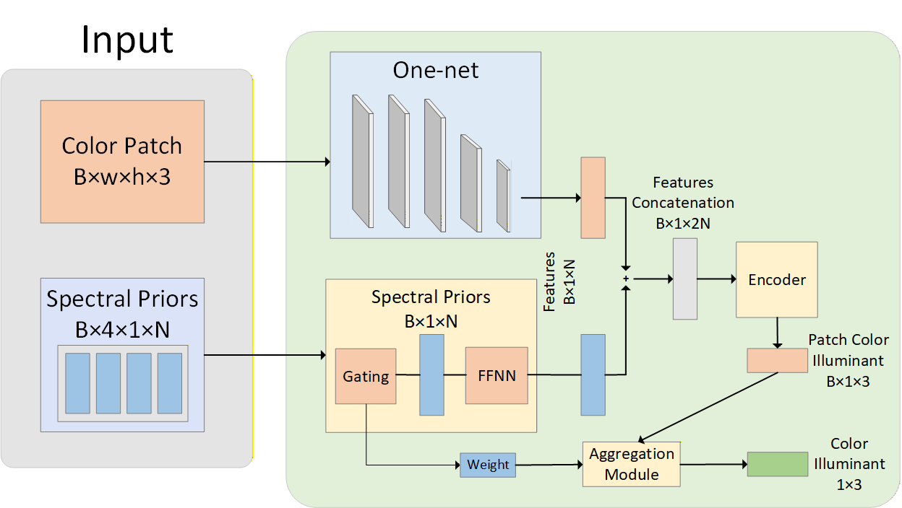

# RGB illuminant estimation based on Spectral Priors

# Code
## Prerequisite
- PyTorch
## Training
run python train.py
## Testing
selecting the related pre-trained model

run python test.py

## Data split and random seeds
- **Split**: 40 scenes for training / 24 scenes for testing.
- **Random seeds**: 666, 100, 200, 300, 400, 0.
